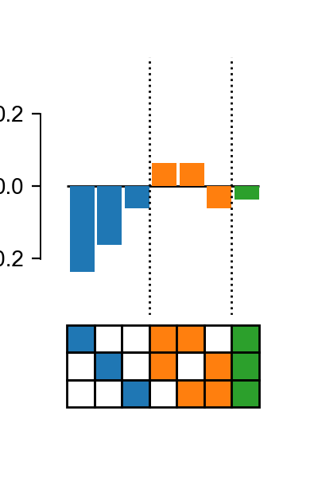

# Epistasis

[](https://gitter.im/harmslab/epistasis?utm_source=badge&utm_medium=badge&utm_campaign=pr-badge&utm_content=badge)
[](https://beta.mybinder.org/v2/gh/harmslab/epistasis-notebooks/master)
[](http://epistasis.readthedocs.io/?badge=latest)
[](https://github.com/harmslab/epistasis/actions?query=workflow%3A%22Epistasis+Tests%22)
[](https://doi.org/10.5281/zenodo.1215853)

*Python API for estimating statistical, high-order epistasis in genotype-phenotype maps.*

All models follow a *Scikit-learn* interface and thus seamlessly plug in to the PyData ecosystem. For more information about the type of models included in this package,
read our [docs](http://epistasis.readthedocs.io/?badge=latest). You can also read more about the theory behind these models in our [paper](https://doi.org/10.1534/genetics.116.195214).

Finally, if you'd like to test out this package without any installing, try these Jupyter notebooks [here](https://mybinder.org/v2/gh/harmslab/epistasis-notebooks/master) (thank you [Binder](https://mybinder.org/)!).

## Examples

The Epistasis package works best in combinations with GPMap, an API for managing
genotype-phenotype map data. Construct a GenotypePhenotypeMap object and pass it
directly to an epistasis model.


```python
# Import a model and the plotting module
from gpmap import GenotypePhenotypeMap
from epistasis.models import EpistasisLinearRegression
from epistasis.pyplot import plot_coefs

# Genotype-phenotype map data.
wildtype = "AAA"
genotypes = ["ATT", "AAT", "ATA", "TAA", "ATT", "TAT", "TTA", "TTT"]
phenotypes = [0.1, 0.2, 0.4, 0.3, 0.3, 0.6, 0.8, 1.0]

# Create genotype-phenotype map object.
gpm = GenotypePhenotypeMap(wildtype=wildtype,
                           genotypes=genotypes,
                           phenotypes=phenotypes)

# Initialize an epistasis model.
model = EpistasisLinearRegression(order=3)

# Add the genotype phenotype map.
model.add_gpm(gpm)

# Fit model to given genotype-phenotype map.
model.fit()

# Plot coefficients (powered by matplotlib).
plot_coefs(model, figsize=(3,5))
```



More examples can be found in these [binder notebooks](https://mybinder.org/v2/gh/harmslab/epistasis-notebooks/master).

## Installation

Epistasis works in Python 3+ (we do not guarantee it will work in Python 2.)

To install the most recent release on PyPi:
```
pip install epistasis
```

To install from source, clone this repo and run:
```
pip install -e .
```

## Documentation

Documentation and API reference can be viewed [here](http://epistasis.readthedocs.io/).

## Dependencies

* [gpmap](https://github.com/harmslab/gpmap): Module for constructing powerful genotype-phenotype map python data-structures.
* [Scikit-learn](http://scikit-learn.org/stable/): Simple to use machine-learning algorithms
* [Numpy](http://www.numpy.org/): Python's array manipulation packaged
* [Scipy](http://www.scipy.org/): Efficient scientific array manipulations and fitting.
* [lmfit](https://lmfit.github.io/lmfit-py/): Non-linear least-squares minimization and curve fitting in Python.

### Optional dependencies

* [matplotlib](): Python plotting API.
* [ipython](): interactive python kernel.
* [jupyter notebook](): interactive notebook application for running python kernels interactively.
* [ipywidgets](): interactive widgets in python.

## Development

We welcome pull requests! If you find a bug, we'd love to have you fix it. If
there is a feature you'd like to add, feel free to submit a
pull request with a description of the addition. We also ask that you write the
appropriate unit-tests for the new feature and add documentation to our Sphinx docs.

To run the tests on this package, make sure you have `pytest` installed and run from the base directory:

```
pytest
```

## Citing
If you use this API for research, please cite this [paper](https://doi.org/10.1534/genetics.116.195214).

You can also cite the software directly:

```
@misc{zachary_sailer_2017_252927,
  author       = {Zachary Sailer and Mike Harms},
  title        = {harmslab/epistasis: Genetics paper release},
  month        = jan,
  year         = 2017,
  doi          = {10.5281/zenodo.1215853},
  url          = {https://doi.org/10.5281/zenodo.1215853}
}
```
