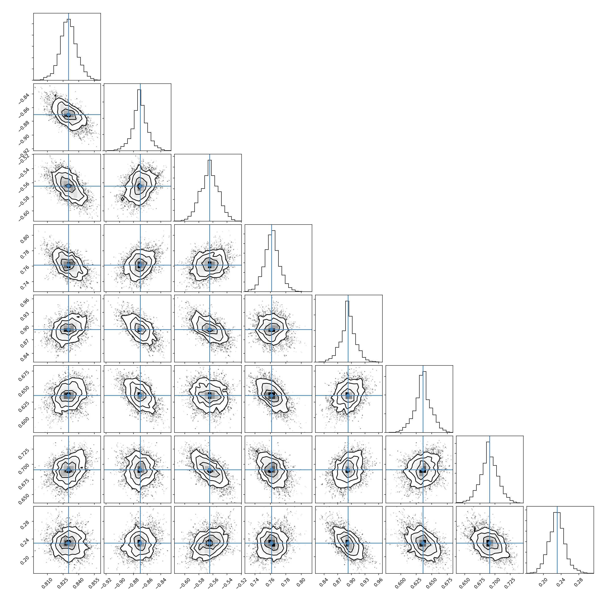

Estimating uncertainty
======================

The epistasis package includes a `sampling` module for estimating uncertainty in
all parameters in a (Non)linear epistasis models. All `Sampling` objects create
a database folder with the epistasis model stored inside a pickle file
and an HDF5 file containing samples used to estimate uncertainty.

.. code-block::

    # Imports
    import matplotlib.pyplot as plt
    import numpy as np
    import corner

    from epistasis.simulate import LinearSimulation
    from epistasis.models import EpistasisLinearRegression
    from epistasis.sampling.bayesian import BayesianSampler

    # Create a simulated genotype-phenotype map with epistasis.
    sim = LinearSimulation.from_length(4, model_type="local")
    sim.set_coefs_order(4)
    sim.set_coefs_random((-1,1))
    sim.set_stdeviations([0.01])

    # Initialize an epistasis model and fit a ML model.
    model = EpistasisLinearRegression.from_gpm(sim, order=4, model_type="local")
    model.fit()

    # Initialize a sampler.
    fitter = BayesianSampler(model)
    fitter.add_samples(500)

    # Plot the Posterior
    fig = corner.corner(bayes.coefs.value, truths=sim.epistasis.values)

