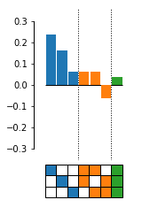

.. epistasis documentation master file, created by
   sphinx-quickstart on Thu Jul  7 15:47:18 2016.
   You can adapt this file completely to your liking, but it should at least
   contain the root `toctree` directive.

``epistasis``
=============

A Python API for modeling statistical, high-order epistasis in genotype-phenotype maps.
You can use this library to:

    1. Decompose genotype-phenotype maps into high-order epistatic interactions
    2. Find nonlinear scales in the genotype-phenotype map
    3. Calculate the contributions of different epistatic orders and
    4. Estimate the uncertainty in the epistatic coefficients and

For more information about the epistasis models in this library, see our Genetics paper:

    `Sailer, Z. R., & Harms, M. J. (2017). "Detecting High-Order Epistasis in Nonlinear Genotype-Phenotype Maps." Genetics, 205(3), 1079-1088.`_

.. _`Sailer, Z. R., & Harms, M. J. (2017). "Detecting High-Order Epistasis in Nonlinear Genotype-Phenotype Maps." Genetics, 205(3), 1079-1088.`: http://www.genetics.org/content/205/3/1079

This library is built on top of well known tools in the scientific Python stack.
It uses packages like matplotlib, numpy, scipy, scikit-learn, and pandas. We strive
to follow similar inferface designs present in this ecosytem. If you notice ways
we can improve, please open an issue on Github! We'd love to hear your feedback.

Currently, this package works only as an API. There is no command-line
interface. Instead, we encourage you use this package inside `Jupyter notebooks`_ .

Basic Example
-------------

.. code-block:: python

    # Import a model and the plotting module
    from gpmap import GenotypePhenotypeMap
    from epistasis.models import EpistasisLinearRegression
    from epistasis.pyplot import plot_coefs

    # Genotype-phenotype map data.
    wildtype = "AAA"
    genotypes = ["ATT", "AAT", "ATA", "TAA", "ATT", "TAT", "TTA", "TTT"]
    phenotypes = [0.1, 0.2, 0.4, 0.3, 0.3, 0.6, 0.8, 1.0]

    # Create genotype-phenotype map object.
    gpm = GenotypePhenotypeMap(wildtype=wildtype,
                               genotypes=genotypes,
                               phenotypes=phenotypes)

    # Inialize an epistasis model.
    model = EpistasisLinearRegression(order=3)

    # Add the genotype phenotype map.
    model.add_gpm(gpm)

    # Fit model to given genotype-phenotype map.
    model.fit()

    # Plot coefficients (powered by matplotlib).
    coef_sites = model.epistasis.sites
    coef_values = model.epistasis.values

    fig, axes = plot_coefs(coef_sites, coef_values, figsize=(2,4))

Documentation
-------------

We are still working hard on the Docs! You may notice blank spots in various
places. We appreciate your patience as we try to catch up on docs.

.. toctree::
   :maxdepth: 2

   pages/quick_guide
   pages/models
   pages/anatomy
   pages/simulate
   pages/visualize
   pages/advanced
   pages/io
   gallery/index.rst
   api/main.rst

Example Gallery
---------------

The following gallery contains various examples from the package.

.. raw:: html

    

.. only:: html

    .. figure:: /gallery/images/thumb/sphx_glr_plot_linear_regression_thumb.png

        :ref:`sphx_glr_gallery_plot_linear_regression.py`

.. raw:: html

    

.. raw:: html

    

.. only:: html

    .. figure:: /gallery/images/thumb/sphx_glr_plot_logistic_regression_thumb.png

        :ref:`sphx_glr_gallery_plot_logistic_regression.py`

.. raw:: html

    

.. raw:: html

    

.. only:: html

    .. figure:: /gallery/images/thumb/sphx_glr_plot_nonlinear_simulation_thumb.png

        :ref:`sphx_glr_gallery_plot_nonlinear_simulation.py`

.. raw:: html

    

Indices and tables
------------------

* :ref:`genindex`
* :ref:`modindex`
* :ref:`search`

.. _Jupyter notebooks: http://jupyter.org/
