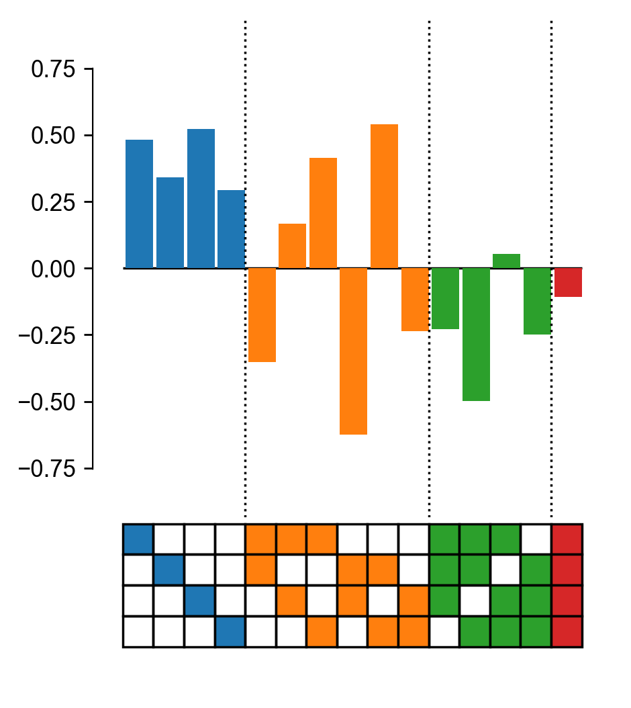
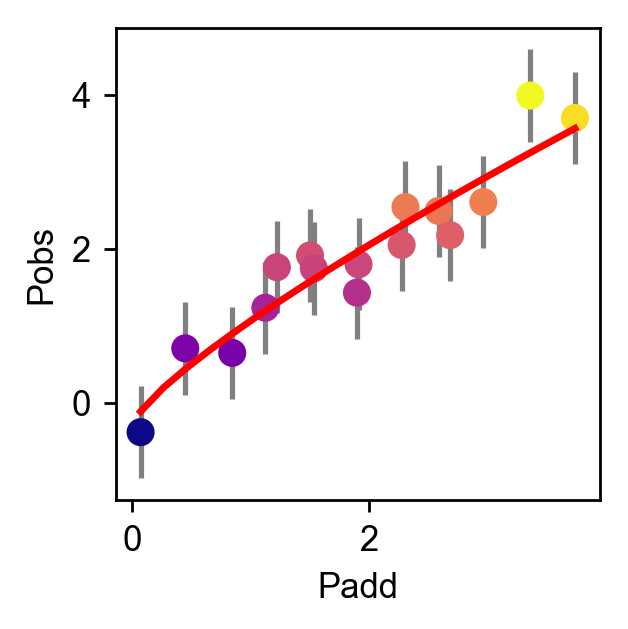

Plotting in the epistasis package
=================================

The ``epistasis`` package comes with a few functions to plot epistasis data.

Plot epistatic coefficients
---------------------------

The plotting module comes with a default function for plotting epistatic
coefficients. It plots the value of the coefficient as bar graphs, the label as
a box plot (see example below), and signficicance as stars using a t-test.

.. code-block:: python

  import matplotlib.pyplot as plt

  from gpmap.simulate import MountFujiSimulation
  from epistasis.models.linear import EpistasisLinearRegression
  from epistasis.pyplot.coefs import plot_coefs

  gpm = MountFujiSimulation.from_length(4, field_strength=-1, roughness=(-2,2))

  model = EpistasisLinearRegression(order=4)
  model.add_gpm(gpm)
  model.fit()

  # Plot coefs
  fig, axes = plot_coefs(model, figsize=(4,5))
  plt.show()

Plot nonlinear scale
--------------------

Plot a nonlinear scale using the ``epistasis.pyplot.nonlinear`` module.

.. code-block:: python

    # Import matplotlib
    import matplotlib.pyplot as plt

    # Import epistasis package
    from gpmap.simulate import MountFujiSimulation
    from epistasis.models.nonlinear import EpistasisPowerTransform
    from epistasis.pyplot.nonlinear import plot_power_transform

    # Simulate a Mt. Fuji fitness landscape
    gpm = MountFujiSimulation.from_length(4, field_strength=-1, roughness=(-2,2))

    # Fit Power transform
    model = EpistasisPowerTransform(lmbda=1, A=0, B=0)
    model.add_gpm(gpm)
    model.fit()

    # Create plot
    fig, ax = plt.subplots(figsize=(3,3))
    plot_power_transform(model, cmap='plasma', ax=ax, yerr=0.6)

    ax.set_xlabel('Padd')
    ax.set_ylabel('Pobs')
    plt.show()

